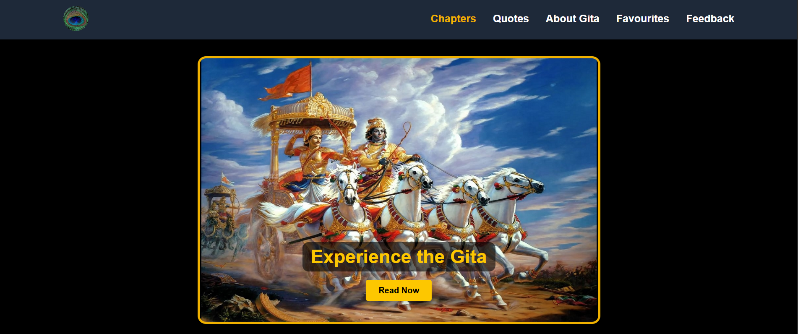

## 📖**Bhagavad Gita Explorer**
A spiritual web app that presents the teachings of the Bhagavad Gita in a beautiful, accessible way. Users can browse all 18 chapters, read verses one-by-one, save favorite chapters, explore inspirational quotes, and even submit their feedback.

# [Deployment Link](https://gita-verse-git-master-anushikas-projects-e657cf47.vercel.app/)

## 🧘 Description

This project is a React-based single-page application that allows users to explore the teachings of the Shreemad Bhagavad Gita. It offers an intuitive interface to:

- Browse chapter summaries
- Read individual verses with navigation
- Maintain a wishlist (favorite chapters)
- Submit feedback on any verse
- Understand the Gita through helpful visuals and an About section

## ✨ Features

- 🔍 **Chapter Explorer** – View all chapters with summaries and detailed "Read More" pages.
- 📜 **Verse Navigator** – Navigate one verse at a time with next/prev arrows.
- 💖 **Wishlist** – Save your favorite chapters for quick access.
- 📢 **Feedback Form** – Submit your insights or questions about any chapter and verse.
- 🤖 **(Coming Soon)**: AI-powered assistant using Gemini API to answer spiritual doubts.
- 📷 **Quote Section** – Beautiful verses shown one at a time.
- 📘 **About Page** – Learn about the importance and teachings of the Gita.

## 🛠 Tech Stack

- **React** (with Hooks and Context API)
- **React Router v6**
- **Tailwind CSS** – For responsive and modern UI
- **Font Awesome** – Icons and visuals
- **Vedic Scriptures API** – Data source for chapters and verses

## 📦 Setup Instructions for Bhagavad Gita Explorer
**1. Clone the Repository**   
git clone https://github.com/Anushika06/Gita-Verse.git  
cd bhagavad-gita-explorer  

**2. Install Dependencies**   
npm install  

**3. Start the Development Server**   
npm run dev  

**4. Open your browser and go to:**   
http://localhost:5173

